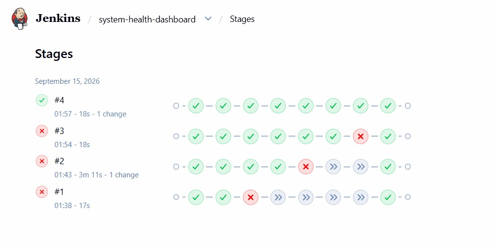
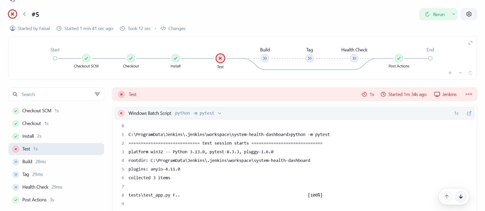
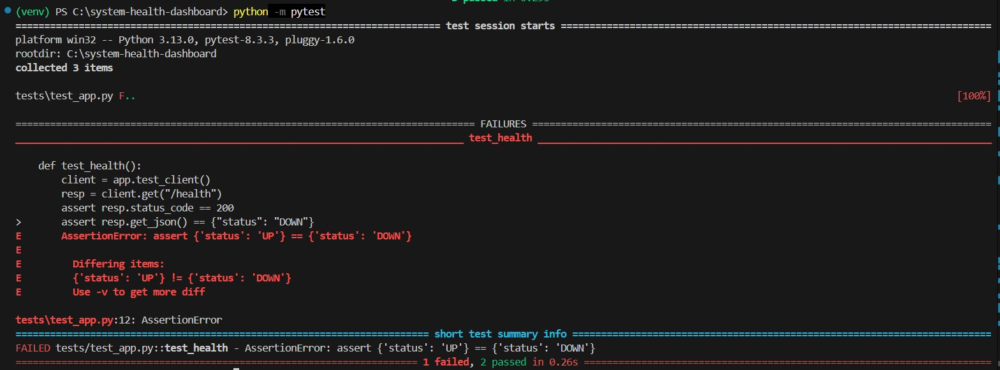
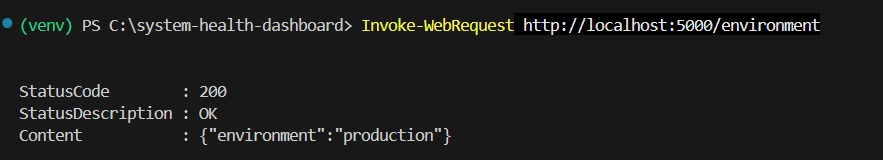

# System Health Dashboard API

A lightweight Flask API that exposes basic status information for an
operations team, delivered through a full Git + DevOps workflow:
feature branches, automated tests, Docker containerisation and a
Jenkins CI pipeline.

## Endpoints

| Endpoint       | Method | Response                              |
|----------------|--------|---------------------------------------|
| `/health`      | GET    | `{"status": "UP"}`                    |
| `/version`     | GET    | `{"version": "1.0.0"}`                |
| `/environment` | GET    | `{"environment": "<env name>"}`       |

The environment name is read from the `APP_ENVIRONMENT` environment
variable and defaults to `development` if it is not set.

## Prerequisites

- Python 3.11+
- pip
- Docker Desktop (for the container workflow)
- Jenkins (for the CI pipeline)

## Setup and running locally

1. Clone the repository:
```bash
   git clone https://github.com/Faehehe/system-health-dashboard.git
   cd system-health-dashboard
```
2. (Optional but recommended) create and activate a virtual environment:
```bash
   python -m venv venv
   venv\Scripts\activate      # Windows
```
3. Install dependencies:
```bash
   pip install -r requirements.txt
```
4. Run the application:
```bash
   python app.py
```
5. The API is available at `http://localhost:5000`. Verify:
   - http://localhost:5000/health
   - http://localhost:5000/version
   - http://localhost:5000/environment

## Running the tests

The full test suite runs with a single command from the repository root:

```bash
python -m pytest
```

This runs automated tests against all three endpoints.

## Container workflow

Build a versioned image:

```bash
docker build -t system-health-dashboard:1.0.0 .
```

Run the container with the environment supplied externally:

```bash
docker run -d -p 5000:5000 -e APP_ENVIRONMENT=production --name shd system-health-dashboard:1.0.0
```

Verify the endpoints as above. Note that `/environment` will now
return `production`, confirming the configuration is externalised and
not hard-coded. Stop and remove the container when finished:

```bash
docker stop shd
docker rm shd
```

## Jenkins pipeline

The `Jenkinsfile` defines a declarative pipeline with the following
stages:

1. **Checkout** – retrieves the repository and branch.
2. **Install** – installs application and test dependencies.
3. **Test** – runs the full automated test suite; a failing test stops
   the pipeline before any image is built.
4. **Build** – builds the Docker image.
5. **Tag** – tags the image with the Jenkins build number and `latest`.
6. **Health Check** – runs the container and polls `/health` until it
   responds successfully.

A post-build step always stops and removes the container to keep the
environment clean.

To run it, configure a Jenkins Pipeline job with "Pipeline script from
SCM", pointing at this repository and the `develop` branch, then
trigger a build.

## Project structure

system-health-dashboard/
├── app.py
├── requirements.txt
├── tests/
│ └── test_app.py
├── conftest.py
├── Dockerfile
├── .dockerignore
├── .gitignore
├── Jenkinsfile
├── MERGE_CONFLICT.md
└── README.md

## Evidence

### Successful Jenkins pipeline


### Pipeline stops on a failed test


### Automated tests failing


### Externalised environment configuration


## Architecture

The project follows a simple Git-to-deployment flow. Code moves through
feature branches into `develop`, and a Jenkins pipeline validates and
containerises every change.

### Delivery workflow

feature/* branches
│ (merge)
▼
develop ───────► Pull Request ───────► main
│
│ (Jenkins polls / build triggered)
▼
┌─────────────────────────────────────────────┐
│ Jenkins Pipeline │
│ │
│ Checkout → Install → Test → Build → Tag → │
│ Health Check│
│ │
│ (a failing Test stage stops the pipeline) │
└─────────────────────────────────────────────┘
│
▼
Docker image (tagged with build number + latest)
│
▼
Running container exposes /health, /version, /environment

### Runtime architecture

HTTP requests
         │
         ▼

┌───────────────────┐
│ Flask app.py │
│ │
│ /health ────┼──► {"status": "UP"}
│ /version ────┼──► {"version": "1.0.0"}
│ /environment ────┼──► reads APP_ENVIRONMENT env var
└───────────────────┘
        │
packaged inside
        ▼
Docker container
(APP_ENVIRONMENT injected at runtime via -e flag)

## AI assistance

In line with the academic-integrity requirement, AI assistance
(Claude) was used as a guide during this project for explanation,
troubleshooting (Java/Jenkins/Docker configuration on Windows) and
drafting. All files were written, run, tested and understood by the
author.